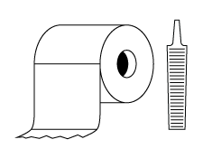

# raspi-tp
    

Raspi TP is an HTML-based frontend for custom-built, Raspberry Pi, Crestron touchpanel alternatives. The name kinda sounds/looks like "raspy" and the acronym for "toilet paper" so we use a toilet paper roll and a rasp as our logo. We fancy ourselves funny.
